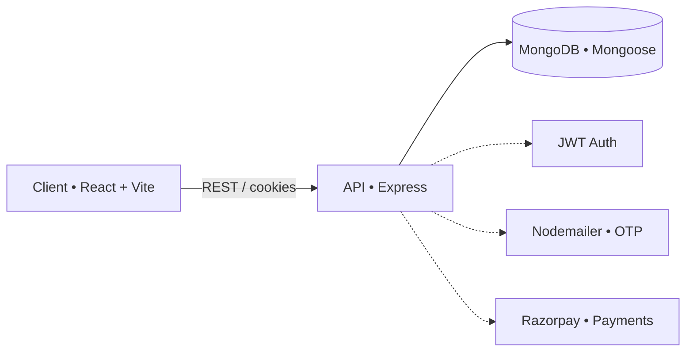
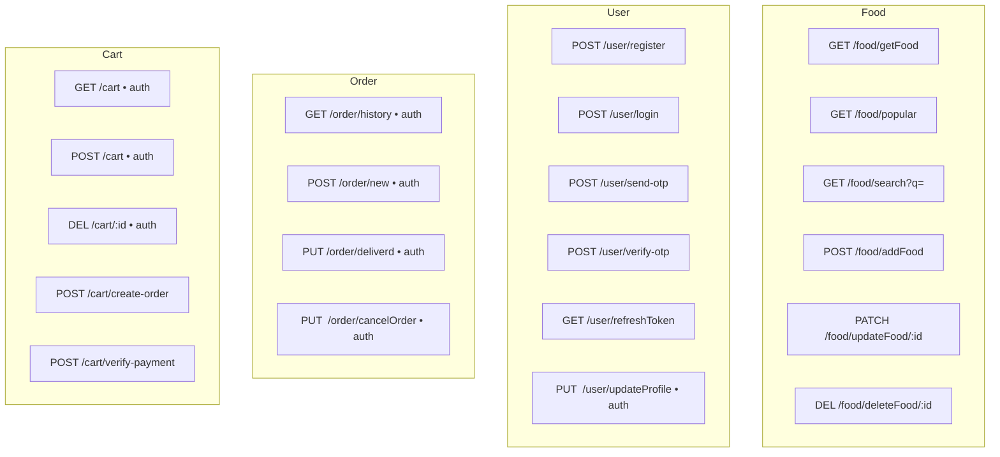
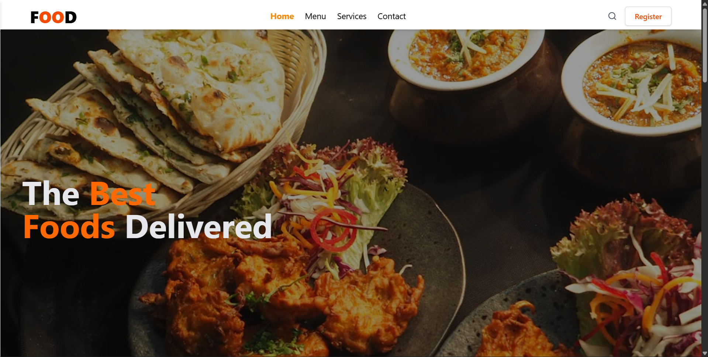
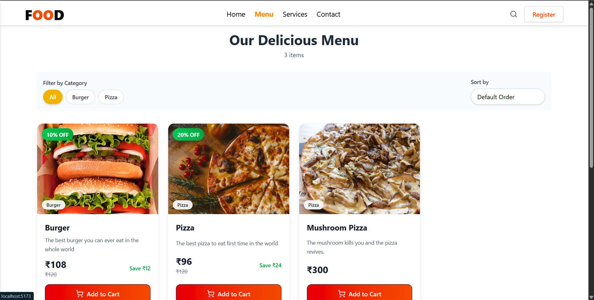
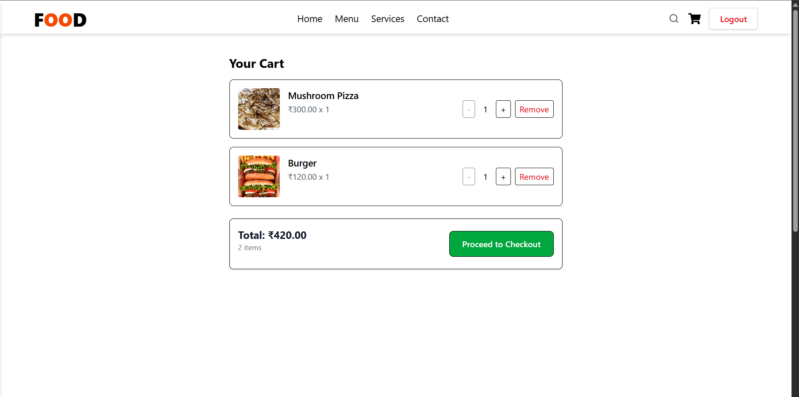
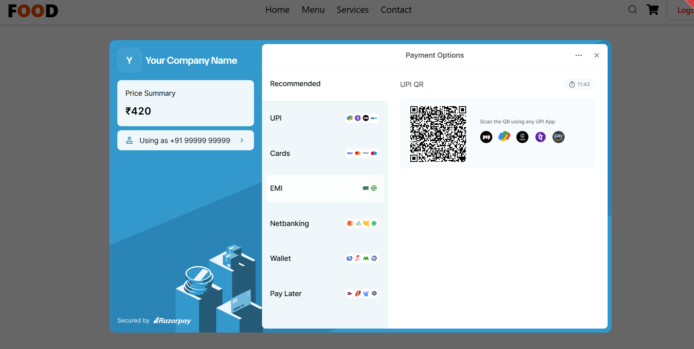

<div align="center">

# 🍽️ Foodie — Modern Food Ordering App

Full‑stack food ordering built with React + TypeScript, Express, and MongoDB. Smooth animations, responsive UI, secure auth, and a delightful ordering flow.

<br>

 
 
 
 
 
 
<a href="https://github.com/Durgeshwar-AI/Food-App/stargazers"></a>

</div>

## � Visual overview



> Tip: Search uses case‑insensitive partial matching across name, description, and category fields.

## ✨ Highlights

- 🔐 Auth with JWT, OTP email verification
- 🍕 Rich menu with categories, offers, and popular items
- 🛒 Cart + order flow (Razorpay integration)
- 🎨 Smooth animations, responsive layout, mouse‑trail effect
- ⚙️ Type‑safe React 18 + TS + Vite

## 🚀 Quick start

Prereqs: Node >= 16, MongoDB running, two `.env` files (`client`, `server`).

```powershell
# 1) Clone
git clone https://github.com/Durgeshwar-AI/Food-App.git 
cd Food-App

# 2) Install
npm i
cd client
npm i
cd ../server
npm i

# 3) Run (two terminals)
# Terminal A
cd server
npm start
# Terminal B
cd client
npm run dev

# Or 3) Run
npm run dev
```

Environment

- server/.env: PORT, MONGO_URI, CORS_APPROVED, JWT_SECRET, RAZORPAY_KEY_ID, RAZORPAY_SECRET, SMTP creds
- client/.env: Vite envs as needed (e.g., VITE_API_URL)

## 🧭 API at a glance

Base URL: `/api`



Search behavior

- Endpoint: `GET /api/food/search?q=<term>`
- Match: case‑insensitive, partial across `name | description | category`
- Limit: up to 50 results

## 🖼️ Screenshots

Add screenshots to `docs/screenshots/` and they’ll render here.

<div align="center">

<!-- Replace with real screenshots -->


<br/>



</div>

## 📁 Project structure

```
Food-App/
├── client/                 # React + TS (Vite)
│   └── src/                # Components, pages, hooks, data
└── server/                 # Express API
      ├── Controllers/        # Route handlers
      ├── Models/             # Mongoose models
      ├── Routes/             # API routes
      └── DB/                 # DB connection
```

## �️ Tech stack

Frontend

- React 18 + TypeScript, Vite, Tailwind CSS
- React Router, Axios, Framer Motion, React Icons

Backend

- Express, Mongoose (MongoDB)
- JWT, Bcrypt, CORS, Helmet, Cookie‑Parser
- Express‑Validator, Multer, Nodemailer
- Razorpay integration

## 🤝 Contributing

Contributions welcome!

1. Fork ➜ create branch ➜ commit ➜ PR
2. Keep commits descriptive, include tests/docs when relevant
3. Follow existing code style and linting

<a href="https://github.com/Durgeshwar-AI/Food-App/issues"></a>

## � License

MIT — see `LICENSE`.

---

Made with ❤️ by Durgeshwar
